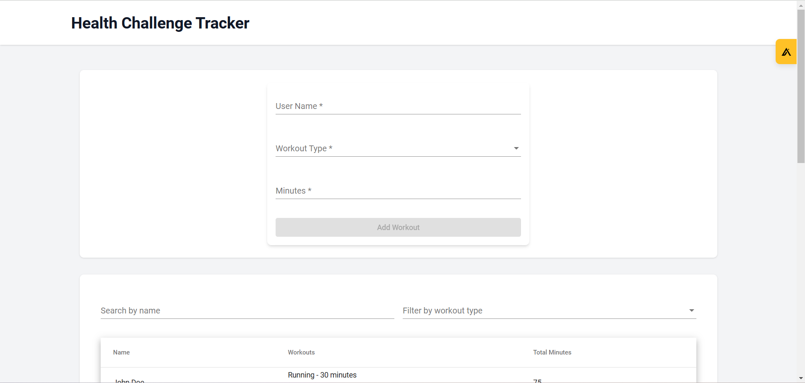
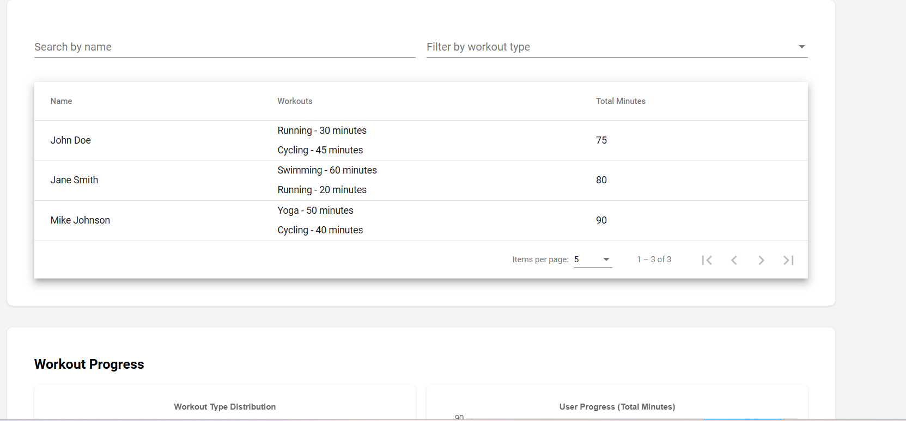
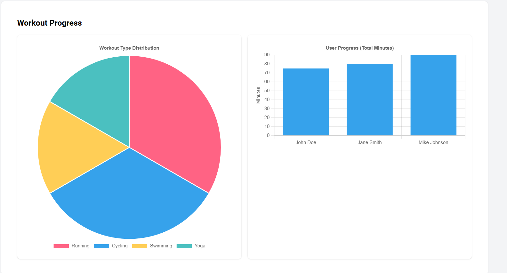

# Health Challenge Tracker

A modern Angular application for tracking workout activities and progress. Built with Angular 14+, Angular Material, and Chart.js.

## Live Demo
[View Live Demo](https://health-challenge-traker.netlify.app/) <!-- You'll add this after deployment -->

## Screenshot
 <!-- You can add a screenshot of your app here -->



## Features

- Add workouts with user name, type, and duration
- Support for custom workout types
- View workouts in a paginated table
- Search users by name
- Filter workouts by type
- Visual workout progress with interactive charts
- Responsive design using Tailwind CSS
- Data persistence using localStorage

## Prerequisites

Before you begin, ensure you have the following installed:
- Node.js (v14 or higher)
- npm (v6 or higher)
- Angular CLI (v14.x.x)
  ```bash
  npm install -g @angular/cli@14
  ```

## Local Development Setup

1. Clone the repository
   ```bash
   git clone <repository-url>
   cd health-challenge-tracker
   ```

2. Install dependencies
   ```bash
   npm install
   ```

3. Start the development server
   ```bash
   ng serve
   ```

4. Open your browser and navigate to `http://localhost:4200`

## Running Tests

Run unit tests with code coverage:
```bash
ng test --code-coverage
```

The code coverage report will be generated in the `coverage` directory.

## Build for Production

To create a production build:
```bash
ng build --configuration production
```

The build artifacts will be stored in the `dist/health-challenge-tracker` directory.


## Technologies Used

- Angular 14+
- Angular Material
- Tailwind CSS
- Chart.js
- RxJS
- TypeScript

## Project Structure

```
src/
├── app/
│   ├── components/
│   │   ├── workout-form/
│   │   ├── workout-list/
│   │   └── workout-chart/
│   ├── services/
│   │   └── workout.service.ts
│   └── interfaces/
│       └── workout.interface.ts
├── assets/
└── styles.scss
```

## Contributing

1. Fork the repository
2. Create your feature branch (`git checkout -b feature/AmazingFeature`)
3. Commit your changes (`git commit -m 'Add some AmazingFeature'`)
4. Push to the branch (`git push origin feature/AmazingFeature`)
5. Open a Pull Request

## License

This project is licensed under the MIT License - see the [LICENSE](LICENSE) file for details.

## Acknowledgments

- Angular Team for the amazing framework
- Chart.js for beautiful charts
- Tailwind CSS for the utility-first CSS framework
